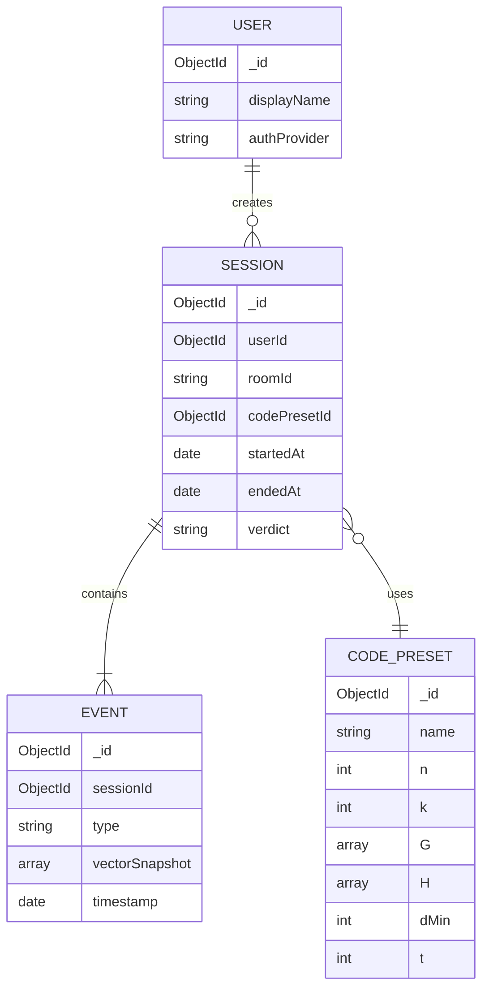

# HammingSpace — The 3D Digital Communication Lab
### Complete Hackathon Solution Blueprint for the Linear Block Codes Problem Statement

> *"Where bits become physical, and errors become visible."*

---

## 1–2. PROBLEM DECOMPOSITION

**A. One sentence:** Students can't feel Hamming distance or syndrome decoding from equations alone, so we turn a `(n,k)` Linear Block Code into a walkable 3D transceiver lab where encoding, noise, and correction happen as visible spatial events.

**B. In simple words:** Today, a student learns `c = mG` and `S = rHᵀ` on paper. They can compute the right answer without ever *seeing* why bit 3 flipping breaks the codeword, or why the syndrome uniquely points back at it. We build a 3D world where the message is a physical object, the channel is a place it flies through, and the syndrome is a diagnostic light that points at the damage.

**C. Why it exists:** Coding theory is taught via matrix mechanics (GF(2) algebra) that is precise but visually flat. Hamming distance, minimum distance `d_min`, and correction capability `t = ⌊(d_min−1)/2⌋` are geometric ideas (distance in an n-dimensional hypercube) that get taught non-geometrically.

**D. Who faces it:** ECE/CSE undergrads in Digital Communication / Information Theory courses; lab instructors who want a repeatable, safe way to demo error correction; self-learners preparing for GATE/placement interviews on ECC.

**E. Existing process:** Whiteboard derivation → hand computation of a couple of `(7,4)` examples → static 2D applets (e.g. vlabs.ac.in) with tables and buttons, no spatial metaphor, no multiplayer/adversarial element.

**F. Problems with it:** No intuition for *why* some errors are recoverable and others aren't; no feel for the "distance" in Hamming distance; single-user, non-competitive, so no urgency or curiosity loop; matrices shown as static grids, not as active transformations.

**G. Root causes:** Coding theory is fundamentally geometric (codewords are points in `{0,1}ⁿ`) but is taught algebraically; existing tools are 2D and passive.

**H. Opportunity:** A 3D, physics-flavored, competitive/collaborative simulation converts an abstract linear-algebra fact ("syndrome uniquely identifies single-bit errors within `t`") into an experienced fact ("I broke it, and I watched the system find exactly where.")

**I. Expected impact:** Faster concept mastery, higher retention (spatial + active learning > passive reading), and a reusable teaching tool for ECE labs beyond the hackathon.

**Chain:** *Coding theory is taught as static algebra* → *students memorize procedures without geometric intuition* → *give them a walkable, breakable, self-correcting 3D codeword space* → *intuitive, sticky understanding of Hamming distance and syndrome decoding.*

**Explicit assumptions made** (PS was silent on these):
- Target `(n,k)` for the MVP demo is the standard systematic `(7,4)` Hamming code (single-error-correcting, `d_min=3`, `t=1`), matching the PS's own user journey. Custom `(n,k)` is an advanced feature.
- "Collaborative Channel Monitoring" is implemented as a 2-role real-time session (Encoder vs. Noise Controller) over WebSockets, not a persistent multi-classroom system.
- WebXR support targets browser-based VR (Quest Browser / WebXR API) as a *progressive enhancement* over the desktop 3D mode, not a hard requirement for the demo.

---

## 3. DOMAIN KNOWLEDGE (only what's needed to build this)

| Concept | What it means | Why we need it |
|---|---|---|
| **GF(2) arithmetic** | Binary field: addition = XOR, multiplication = AND, no carries. | All encoding/decoding math is matrix operations over GF(2). |
| **`(n,k)` Linear Block Code** | Maps a `k`-bit message to an `n`-bit codeword; `n−k` bits are redundancy (parity). Rate `R=k/n`. | Defines console layout: `k` togglable input bits, `n` output slots. |
| **Generator Matrix `G` (`k×n`)** | Linear map `c = mG`. Systematic form `G=[Iₖ｜P]` keeps the message bits visible unmodified inside the codeword. | Drives the "Encoding Visualization" and "Identity vs Parity" requirement. |
| **Parity-Check Matrix `H` (`(n−k)×n`)** | Satisfies `GHᵀ=0`. Any valid codeword satisfies `cHᵀ=0`. Systematic form `H=[Pᵀ｜I_{n−k}]`. | Drives syndrome computation. |
| **Syndrome `S = rHᵀ`** | `r` = received (possibly corrupted) vector. `S=0` ⇒ `r` is a valid codeword (or an undetectable error). `S≠0` ⇒ error detected. | Core of the "Error Trapping Feedback" requirement. |
| **Syndrome table / standard array** | Precomputed map from every possible syndrome to the *most likely* (lowest-weight) error pattern that produces it. | Drives "Correction Animation" — snap back using table lookup, not brute force. |
| **Hamming distance `d(x,y)`** | Number of positions two vectors differ in = weight of their XOR. | This *is* the "spatial separation" the PS wants visualized — literally the number of edges between two corners of the n-cube. |
| **Minimum distance `d_min`** | Smallest Hamming distance between any two distinct codewords. For linear codes, `d_min` = minimum weight of any non-zero codeword. | Determines correction capability. |
| **Error-correcting capability `t`** | `t = ⌊(d_min − 1)/2⌋`. Errors of weight ≤ `t` are guaranteed correctable. | This is "the exact point where a code's capacity is exceeded" — the PS explicitly asks us to demonstrate this failure boundary. |
| **Linearity** | Sum (XOR) of any two codewords is itself a codeword. | Required demo: pick codewords `c1`, `c2`, show `c1⊕c2` is also a valid point in the codeword cluster. |
| **Systematic (7,4) Hamming code** | Standard textbook example, `d_min=3`, `t=1`, rate `4/7`. | Our MVP's default, fully worked example below. |

**Worked example we will hard-code as the MVP demo path** (matches the PS's exact user journey — message `1011`, tap bit 3):

```
Systematic G (4×7):                Systematic H (3×7):
1 0 0 0 | 1 1 0                    1 1 0 1 | 1 0 0
0 1 0 0 | 1 0 1                    1 0 1 1 | 0 1 0
0 0 1 0 | 0 1 1                    0 1 1 1 | 0 0 1
0 0 0 1 | 1 1 1

m = 1 0 1 1
c = m·G (mod 2) = 1 0 1 1 0 1 0

Noise Controller taps bit 3 → r = 1 0 0 1 0 1 0   (e = 0010000)

S = r·Hᵀ (mod 2) = (0, 1, 1)
→ matches column 3 of H exactly ⇒ decoder flags bit 3 as the culprit
→ correction: flip bit 3 back ⇒ recovers c = 1 0 1 1 0 1 0 ✅
```
This single example is deterministic, verifiable, and demonstrably correct — it becomes our regression test, our demo script, and our video-recorded fallback if live noise injection glitches on stage.

---

## 4. THE PROPOSED SOLUTION

**Product name:** **HammingSpace**
**One-line pitch:** A walkable 3D lab where you build, break, and heal error-correcting codes with your hands instead of your calculator.

**Executive summary:** HammingSpace renders a Transmitter console, a Noisy Channel corridor, and a Receiver console as a single connected 3D scene. A student toggles `k` bits, watches `G` transform the message into an `n`-bit codeword object, physically "hits" bits mid-flight to inject errors, then watches the Receiver's `H`-matrix compute a syndrome and snap the corrupted object back into place — or fail visibly once the error exceeds `t`. A second browser tab (or headset) can join as "Noise Controller" for a real-time adversarial mode.

**Core idea:** Every abstract quantity in the theory (`m`, `G`, `c`, `e`, `r`, `H`, `S`) is rendered as a distinct, labeled 3D object with its own animation, so the *sequence of operations* becomes a *sequence of visible events*.

**Main differentiators vs. existing labs (e.g. vlabs.ac.in):** 3D + spatial distance metaphor, real-time multiplayer adversarial mode, live "capacity exceeded" failure demonstration, exportable session log, optional WebXR walk-through of the `H` matrix.

**Key innovation:** Treating Hamming distance as literal 3D distance — codewords are placed in the scene such that visual separation between two rendered codeword nodes is proportional to their real Hamming distance, so `d_min` is something you can *see* as the tightest gap in a cluster of glowing points, not just a computed number.

**End-to-end workflow:**
`User toggles bits → G transforms m into c (visual) → c flies through Channel → user/opponent injects e → r arrives at Receiver → H computes S (visual) → correct/detect/fail decision → correction animation or alarm → session log entry → feedback to user`

---

## 5. REQUIREMENTS

### Functional Requirements

| # | Feature | Who | Input | Processing | Output |
|---|---|---|---|---|---|
| F1 | Bit Console | Student | Click/tap on k toggle switches | Update message vector `m` in state | 3D toggle lights change color |
| F2 | Encode & Send | Student | `m`, selected `G` | Compute `c = mG mod 2` client-side | Codeword object spawns, animates into Channel |
| F3 | Matrix Viewer (G/H) | Student | Select code preset or custom matrix | Render matrix as 3D grid, color-code `I` vs `P` blocks | Interactive floating matrix |
| F4 | Noise Injection | Student or Noise Controller | Click a bit-cell of the flying codeword | Toggle that bit; recompute `e = c⊕r` | Bit turns red, spins, packet visibly distorts |
| F5 | Syndrome Decoder | System (Receiver) | `r`, `H` | Compute `S = rHᵀ mod 2` | 3D syndrome vector projected + matched against table |
| F6 | Error Trapping Alert | System | `S` | If `S≠0` → detected; if weight(e) > t → uncorrectable | Red hologram "ERROR DETECTED" / amber "UNCORRECTABLE" |
| F7 | Correction Animation | System | `S`, syndrome table | Look up most likely `e`, compute `ĉ = r⊕ê` | Bit(s) snap back, packet turns green |
| F8 | Collaborative Mode | 2 users | WebSocket room code | Sync `c` transmission + injected errors across clients | Both clients see same 3D event stream in real time |
| F9 | Session Log & Export | Student | End of run | Aggregate all vectors, `d(c,r)`, verdict | Downloadable JSON/PDF summary |
| F10 | Custom `(n,k)` Config | Advanced user | Custom `G`/`H` (validated `GHᵀ=0`) | Recompute `d_min`, `t` from new code | Updated matrices + capability badge |
| F11 | WebXR Walkthrough | Student (VR) | Enter XR mode | Scale scene to room size | Walk between rows/columns of `H` |

### Non-Functional Requirements

| Category | Requirement |
|---|---|
| Performance | 60 FPS scene rendering (PS hard requirement); GF(2) math is O(n·k) — trivially fast, never a bottleneck |
| Scalability | MVP: single Node process handles dozens of concurrent rooms; production: horizontal Socket.io scaling via Redis adapter |
| Reliability | Deterministic math engine covered by unit tests against known Hamming(7,4) vectors |
| Availability | Not mission-critical for hackathon; target 99%+ during demo window only |
| Security | Session rooms use unguessable codes; input validated server-side for multiplayer to prevent illegal matrix injection |
| Maintainability | Shared TypeScript GF(2) library used by both client (instant feedback) and server (authoritative check in multiplayer) |
| Usability | Every abstract symbol (`m,G,c,e,r,H,S`) always labeled on-screen; color legend always visible |
| Accessibility | Keyboard-navigable bit toggles; colorblind-safe palette (red/green paired with icons, not color alone) |
| Privacy | No PII required — guest sessions by default; optional login only to save history |
| Observability | Client logs key events (encode, inject, decode) to backend for the session log feature |

---

## 6. MVP vs ADVANCED vs FUTURE

| Tier | Scope |
|---|---|
| **MVP (Must Build)** | Single-user flow, fixed systematic `(7,4)` Hamming code, 3D Transmitter→Channel→Receiver scene, bit console, encode animation, manual single-bit noise injection, syndrome computation + visual alert, correction animation, basic session log (on-screen, not exported) |
| **Should Build** | Matrix viewer distinguishing `I`/`P` blocks, linearity demo (sum of two codewords), "capacity exceeded" failure case (inject 2 errors on `t=1` code and show incorrect correction), exportable session log (JSON) |
| **Nice to Have (Advanced)** | Real-time 2-user Collaborative Channel Monitoring, custom `(n,k)` matrix editor with live `d_min`/`t` recompute, WebXR mode, AI Lab Assistant that explains results in plain language |
| **Future Scope (post-hackathon)** | Classroom mode (instructor dashboard, many students), code library (BCH, Reed-Solomon, convolutional codes), persistent accounts + progress tracking, LMS integration (Moodle/Canvas) |

---

## 7. SYSTEM ARCHITECTURE

```mermaid
flowchart LR
    subgraph Client["Browser Client (React + R3F/Three.js)"]
        UI[Console UI Overlays]
        Scene[3D Scene: Tx / Channel / Rx]
        GF2C[GF(2) Math Engine - Client]
        XR[WebXR Layer]
    end

    subgraph Server["Node.js Backend"]
        API[REST API - Express]
        WS[Socket.io Gateway]
        GF2S[GF(2) Math Engine - Server, authoritative for multiplayer]
        AI[Optional: AI Lab Assistant proxy]
    end

    subgraph Data["Data Layer"]
        Mongo[(MongoDB Atlas - sessions, code presets, logs)]
        Redis[(Redis - room state, Socket.io adapter)]
    end

    UI --> Scene
    Scene --> GF2C
    GF2C -- encode/inject events --> WS
    WS --> GF2S
    GF2S --> Redis
    GF2S --> Mongo
    UI -- save/export/login --> API
    API --> Mongo
    UI -- "explain this result" --> AI
    AI -- context: m,G,c,e,r,H,S --> LLM[(Anthropic Claude API)]
```

**Why this shape:** The math is cheap and deterministic, so it's duplicated client-side (instant 60 FPS feedback, PS requirement) and server-side (authoritative check only needed once a second player can inject errors — otherwise a malicious client could fake a "correction"). REST handles session persistence/export; WebSockets handle the live multiplayer event stream. AI is a thin, optional add-on, not a dependency for the core loop.

---

## 8. SYSTEM DESIGN

### Frontend
- **Pages:** `/lab` (main 3D scene), `/lab/:roomId` (collaborative session), `/history` (past sessions), `/xr` (WebXR entry)
- **Key components:** `<BitConsole>`, `<MatrixPanel G|H>`, `<Codeword3D>`, `<ChannelZone>`, `<SyndromeReadout>`, `<SessionLog>`, `<RoomLobby>`
- **State management:** Zustand store holding `{m, G, H, c, e, r, S, verdict, history[]}` — single source of truth the 3D scene subscribes to reactively
- **User flows:** Solo Encode→Break→Fix loop; Multiplayer Join Room→Assign Role→Live loop
- **Visualizations:** matrix grids as colored voxel planes; codeword as a chain of 7 glowing spheres; syndrome as a 3-light "diagnostic panel"

### Backend
- **Services:** `CodeService` (validate/generate `G`,`H`, compute `d_min`,`t`), `SessionService` (log + export), `RoomService` (Socket.io room lifecycle)
- **Routes:** see API design below
- **Middleware:** JSON body validation (Zod/Joi), rate limiting on room creation, CORS restricted to frontend origin
- **Auth:** optional JWT for saved history; guest UUID otherwise
- **Validation:** server re-validates any client-submitted custom `G` satisfies `GHᵀ = 0` before accepting it

### Database
**MongoDB collections** (chosen over SQL because sessions/logs are naturally nested, variable-shaped documents — a fixed relational schema would force awkward joins for something this document-shaped; no cross-table transactional integrity is actually needed here):



---

## 9. API DESIGN

**POST `/api/codes/validate`** — validate a custom `(n,k)` code
Auth: none (rate-limited)
```json
// Request
{ "n": 7, "k": 4, "G": [[1,0,0,0,1,1,0], "...3 more rows"] }
// Response
{ "valid": true, "H": [["1,1,0,1,1,0,0"], "...2 more rows"], "dMin": 3, "t": 1 }
```
Errors: `400` if `G` isn't full-rank / not systematic-derivable.

**POST `/api/encode`** — server-authoritative encode (used in multiplayer)
```json
// Request
{ "codePresetId": "hamming74", "m": [1,0,1,1] }
// Response
{ "c": [1,0,1,1,0,1,0] }
```

**POST `/api/decode`** — server-authoritative syndrome decode
```json
// Request
{ "codePresetId": "hamming74", "r": [1,0,0,1,0,1,0] }
// Response
{ "S": [0,1,1], "detected": true, "correctable": true, "errorPosition": 3, "corrected": [1,0,1,1,0,1,0] }
```

**POST `/api/sessions`** — create/finalize a session log
Auth: guest UUID or JWT
```json
// Request
{ "codePresetId": "hamming74", "events": ["...event objects..."] }
// Response
{ "sessionId": "665f...", "downloadUrl": "/api/sessions/665f.../export" }
```

**GET `/api/sessions/:id/export`** — returns JSON (or PDF) session summary. `404` if not found.

**WebSocket events (`Socket.io`, namespace `/lab`):**
`room:join {roomId, role}` → `room:state {m,c,r,S,...}` (broadcast) · `channel:inject {bitIndex}` → `channel:updated {r,e}` (broadcast) · `receiver:decode` → `receiver:result {S,verdict,corrected}` (broadcast)

---

## 10. TECHNOLOGY STACK

| Layer | Choice | Why | Alternative considered → why not |
|---|---|---|---|
| 3D rendering | **Three.js via React Three Fiber** | Declarative, integrates cleanly with React state (Zustand), huge ecosystem, WebXR support via `@react-three/xr` | Babylon.js — equally capable but weaker React-ergonomics for a fast hackathon build |
| Frontend framework | **React + Vite** | Fast dev server, component reuse for console/matrix UI panels | Next.js — SSR unneeded for a client-heavy 3D app, adds build complexity |
| State | **Zustand** | Minimal boilerplate, plays well with frequent 3D frame updates | Redux — too much ceremony for hackathon timeline |
| Styling | **Tailwind CSS** | Fast to build clean HUD-style overlays | Styled-components — slower iteration |
| Backend | **Node.js + Express** | Same language as frontend (shared GF(2) TS library, zero context switching), fast to stand up | FastAPI (Python) — great for ML, unnecessary here since there's no heavy ML |
| Real-time | **Socket.io** | Simplest reliable abstraction over WebSockets with room support, exactly matches "Collaborative Channel Monitoring" | Raw WebSocket API — more boilerplate, no auto-reconnect/rooms |
| Database | **MongoDB Atlas** | Session/event logs are naturally document-shaped; free tier is enough for a demo | PostgreSQL — fine too, but forces normalization overhead for data that's inherently nested |
| Cache/Pub-sub | **Redis (Upstash free tier)** | Needed only if scaling Socket.io across >1 server instance; cheap insurance | Skip entirely for MVP — single server instance is enough for a demo |
| AI (optional) | **Anthropic Claude API (claude-sonnet)**, plain prompting | Explaining a fully-known, structured result (`m,G,c,e,r,H,S`) needs no retrieval or fine-tuning — just format the state as context and ask for a plain-language explanation | RAG/vector DB — no external knowledge base exists to retrieve from; would be engineering theatre |
| Hosting (frontend) | **Vercel** | Zero-config static + edge hosting, instant preview URLs for judges | Netlify — equally fine, Vercel chosen for familiarity |
| Hosting (backend) | **Render or Railway** | Free/cheap always-on Node hosting with WebSocket support | AWS EC2/ECS — massive overkill for a hackathon timeline |

---

## 11. AI/ML DESIGN — is AI actually needed here?

**Determination:** The core challenge (encode/inject/decode) is **pure deterministic linear algebra over GF(2)** — there is no pattern to learn, no ambiguous input to classify, and no dataset. Bolting a neural model onto this would be decorative, not useful. **We do not use ML for the core loop.**

Where AI *does* add real value: an optional **"AI Lab Assistant"** panel that takes the current fully-known state (`m, G, H, c, e, r, S`, verdict) and produces a natural-language explanation ("Bit 3 flipped during transit. The syndrome (0,1,1) exactly matches column 3 of H, which is why the decoder isolated that bit with certainty.") This is **prompt engineering only** — structured JSON state → templated system prompt → Claude API → text response. No RAG (nothing to retrieve — the entire "knowledge base" is the 20-or-so lines of linear algebra theory, which fits directly in the prompt), no embeddings, no fine-tuning, no agents/tool-calling (the assistant only explains, it never needs to act on the world). This keeps the AI feature genuinely useful without inflating scope.

**Failure handling:** if the Claude API call fails or times out, the panel falls back to a canned template explanation generated from the same state object — the lab never depends on AI to function.

---

## 12. ALGORITHMS

| Algorithm | Solves | Input → Output | Complexity | Notes |
|---|---|---|---|---|
| **GF(2) matrix–vector multiply** | `c = mG`, `S = rHᵀ` | `(1×k)·(k×n)` or `(1×n)·(n×(n-k))` → row vector | O(k·n) time, O(n) space | XOR-AND only, no floating point — trivial to keep at 60 FPS |
| **Systematic form check / derive H from G** | Turn `G=[I｜P]` into `H=[Pᵀ｜I]` | `G` → `H` | O(k·(n−k)) | Needed for the Custom Code feature (F10) |
| **Minimum distance via codeword enumeration** | Find `d_min` for small custom codes | all `2ᵏ` messages → min weight of non-zero codewords | O(2ᵏ·n) | Fine for hackathon-scale `k≤10`; production would use bounded-distance search for larger `k` |
| **Syndrome table construction** | Precompute error pattern per syndrome | all single/low-weight error vectors → syndrome map | O(2^(n-k)) worst case, but only weight-≤t patterns needed | Standard-array method restricted to correctable weights |
| **Minimum-distance (nearest codeword) decoding** | Given `S`, find most likely `e` | `S` → `ê` (table lookup) | O(1) after table built | This *is* the "Correction Animation" logic |
| **Hamming weight** | `wt(e)` to test against `t` | vector → integer count of 1s | O(n) | Trivial popcount |

---

## 13. DATA FLOW

`Client: bit toggle → local state update (m) → GF2C.encode(m,G) → c rendered`
`Client: bit tap on flying codeword → e updated locally AND emitted via WS`
`Server: receives inject event → recomputes r,e authoritatively → broadcasts to both clients (prevents cheating in multiplayer)`
`Client: on packet arrival → GF2C.decode(r,H) → S,verdict rendered instantly; server decode used only to reconcile in multiplayer`
`On session end → client posts full event array to /api/sessions → stored in Mongo → export endpoint returns JSON/PDF`

Storage: Mongo (session history), Redis (live room state only, ephemeral). Transformation: entirely in the shared TS GF(2) library, used both client- and server-side. Computation: client for instant feedback, server as source of truth for multiplayer fairness. Logs: `EVENT` documents per session for the exportable log feature.

---

## 14. UI/UX DESIGN

| Screen | Purpose | Key elements | User actions |
|---|---|---|---|
| **Lobby / Landing** | Entry point, choose Solo or Collaborative | Code preset picker, "Enter Lab" / "Create Room" | Select mode, enter |
| **Transmitter Console** | Compose message | `k` toggle switches, live `G` matrix panel with `I`/`P` color split | Toggle bits, press Encode & Send |
| **Channel Zone** | Watch + break the codeword | Flying codeword (chain of spheres), noise-injection cursor | Click a bit to flip it |
| **Receiver Console** | See detection + correction | `H` matrix panel, 3-light syndrome readout, alert hologram | Press "Correct Error", inspect syndrome-to-column match highlight |
| **Capacity Test Mode** | Demonstrate correction limits | Same as above but pre-armed to inject 2 errors on `(7,4)` | Trigger, observe incorrect "correction" → teaches `t` boundary |
| **Session Log** | Reflection + export | Table of all events, `d(c,r)`, verdict, Download button | Export JSON/PDF |
| **Room Lobby (multiplayer)** | Pair Encoder + Noise Controller | Room code, role badges, ready state | Join/share code |

**Ideal user journey** mirrors the PS's own Steps 1–8 exactly (see Section 29 Demo Script) — this was a deliberate design choice so the "spec" and the "demo" are the same script.

**UX principle:** every symbol on screen carries its algebraic label (`m`, `c`, `S`, etc.) at all times, so students connect the visual event to the matrix equation instantly rather than trusting the animation blindly.

---

## 15. DATABASE DESIGN (detailed)

**`codePresets`**
| Field | Type | Required | Description | Index |
|---|---|---|---|---|
| `_id` | ObjectId | ✓ | preset id | PK |
| `name` | string | ✓ | e.g. "Hamming(7,4)" | unique |
| `n`,`k` | int | ✓ | code dimensions | |
| `G`,`H` | int[][] | ✓ | matrices | |
| `dMin`,`t` | int | ✓ | precomputed capability | |

**`sessions`**
| Field | Type | Required | Description | Index |
|---|---|---|---|---|
| `_id` | ObjectId | ✓ | | PK |
| `userId` | ObjectId/null | | null = guest | index |
| `roomId` | string/null | | multiplayer room | index |
| `codePresetId` | ObjectId | ✓ | FK-like ref | |
| `startedAt`,`endedAt` | date | ✓ | | |
| `verdict` | enum(`corrected`,`uncorrectable`,`no-error`) | ✓ | | |

**`events`**
| Field | Type | Required | Description | Index |
|---|---|---|---|---|
| `_id` | ObjectId | ✓ | | PK |
| `sessionId` | ObjectId | ✓ | | index |
| `type` | enum(`encode`,`inject`,`decode`,`correct`) | ✓ | | |
| `vectorSnapshot` | int[] | ✓ | the relevant vector at that moment | |
| `timestamp` | date | ✓ | | |

Example document (`events`):
```json
{ "sessionId": "665f1a...", "type": "inject", "vectorSnapshot": [1,0,0,1,0,1,0], "timestamp": "2026-09-23T10:12:00Z" }
```

---

## 16. SECURITY

- **Auth:** optional JWT (short-lived) for saved history; guest sessions need none — this is a learning tool, not a system holding sensitive data.
- **Input validation:** all client-submitted matrices validated server-side (correct dimensions, binary entries only, `GHᵀ=0` for custom codes) before acceptance — prevents malformed data crashing the shared math engine.
- **Multiplayer integrity:** server recomputes `c`/`S` authoritatively rather than trusting whatever a client broadcasts, so a "Noise Controller" can't spoof a fake correction.
- **Rate limiting:** room creation and `/api/codes/validate` are rate-limited to prevent abuse.
- **CORS:** backend restricted to the deployed frontend origin.
- **AI prompt injection:** the AI Lab Assistant only ever receives structured, server-validated numeric state (not raw free-text from another user) as context, so there's no injectable natural-language surface from a second player.
- **Secrets:** API keys (Claude, Mongo, Redis) via environment variables only, never committed.

---

## 17. SCALABILITY: hackathon vs. production

| | Hackathon | Production |
|---|---|---|
| Backend | single Node process | horizontally scaled behind a load balancer |
| Real-time | single Socket.io instance | Socket.io + Redis adapter across multiple instances |
| DB | Mongo Atlas free tier | sharded/replicated cluster, read replicas for session history |
| AI calls | direct per-request | queued/cached explanations for repeated identical states |
| Static assets | Vercel edge | same, plus CDN for any 3D model/texture assets |

We deliberately do **not** introduce microservices, Kubernetes, or message queues for the hackathon build — a single Express service and one Socket.io namespace comfortably handles a classroom-sized demo.

---

## 18. ERROR HANDLING

| Failure | Detection | Response | User experience |
|---|---|---|---|
| Invalid custom `G` (not full rank) | Server validation | `400` with reason | Toast: "This matrix can't generate a valid code — try again" |
| WebSocket disconnect mid-session | Socket.io disconnect event | Auto-reconnect, resync room state from server | Brief "Reconnecting…" overlay, no data loss |
| AI API timeout/failure | try/catch around fetch | Fallback to canned template explanation | User never sees a broken panel |
| DB write failure on session save | try/catch, retry once | Queue locally, retry on reconnect | "Saved offline — will sync" |
| Two users inject simultaneously | server-side event ordering (timestamp) | Apply in received order, broadcast canonical state | Both clients converge to same visual state within one frame |

---

## 19. TESTING STRATEGY

- **Unit tests (Jest):** GF(2) multiply, syndrome computation, and the full worked `(7,4)` example above as a golden-path regression test — if this fails, nothing else matters.
- **Integration tests:** `/api/encode` → `/api/decode` round-trip for every single-bit error position (7 cases for `(7,4)`), confirming 100% single-error correction as theory predicts.
- **Multiplayer test:** two simulated Socket.io clients, one injects, both must converge to identical state.
- **E2E (Playwright):** full user journey — toggle bits, encode, inject, decode, correct, export log.
- **Performance test:** frame-rate monitor during codeword flight + matrix render, must hold ≥60 FPS (PS hard requirement).
- **Key test cases:** zero-error transmission (`S=0`), single correctable error (each of 7 positions), double error exceeding `t` (must show "uncorrectable", not a wrong silent "fix").

---

## 20. DEPLOYMENT

- **Development:** `npm run dev` for Vite frontend + `nodemon` backend, local Mongo via Docker, `.env` for secrets.
- **Staging (optional):** Render/Railway preview deploys per PR.
- **Production (demo):** Frontend → Vercel; Backend + Socket.io → Render (WebSocket-capable); DB → MongoDB Atlas free cluster; Redis → Upstash free tier; HTTPS automatic on both platforms; custom domain optional.
- **CI/CD:** GitHub Actions running Jest + lint on push; auto-deploy on merge to `main`.

---

## 21. PROJECT STRUCTURE

```
hammingspace/
├── frontend/
│   ├── src/
│   │   ├── scene/          # Three.js/R3F components: Codeword3D, MatrixPanel, ChannelZone
│   │   ├── ui/              # HUD overlays: BitConsole, SyndromeReadout, SessionLog
│   │   ├── state/           # Zustand store
│   │   └── xr/              # WebXR entry
│   └── vite.config.ts
├── backend/
│   ├── src/
│   │   ├── routes/          # codes, encode, decode, sessions
│   │   ├── sockets/         # room lifecycle, inject/decode events
│   │   ├── services/        # CodeService, SessionService, RoomService
│   │   └── models/          # Mongoose schemas
│   └── server.ts
├── shared/
│   └── gf2/                 # GF(2) math library, used by BOTH frontend and backend
├── docs/
└── README.md
```
`shared/gf2` is the single most important directory — it guarantees client and server never disagree on the math.

---

## 22. IMPLEMENTATION PLAN

| Phase | Tasks | Output | Priority |
|---|---|---|---|
| 1. Setup | Repo, shared GF2 lib skeleton, CI | Buildable skeleton | Must |
| 2. Core backend | `/api/encode`, `/api/decode`, validation | Working REST math API | Must |
| 3. Database | Mongo schemas, session save/export | Persisted sessions | Should |
| 4. Frontend shell | React + R3F scene, bit console, matrix panel | Static 3D scene | Must |
| 5. Core algorithm wiring | Connect UI state → GF2 lib → 3D animation | Full encode→inject→decode loop working solo | Must |
| 6. AI (optional) | Claude API proxy + explain panel | "Explain this" feature | Nice to have |
| 7. Integration | Socket.io multiplayer wiring | 2-player collaborative mode | Nice to have |
| 8. Testing | Jest + Playwright suites | Green CI | Should |
| 9. Deployment | Vercel + Render + Atlas | Live demo URL | Must |
| 10. Demo prep | Script rehearsal, fallback recording | Judge-ready demo | Must |

---

## 23. TEAM DISTRIBUTION (4 developers)

- **Dev 1 — 3D/WebXR:** Three.js scene, codeword animation, matrix visualization, WebXR layer.
- **Dev 2 — Frontend UI/State:** React overlays (consoles, syndrome readout, session log), Zustand store, connects UI to Dev 1's scene and Dev 3's API.
- **Dev 3 — Backend/Math:** shared GF(2) library, REST API, Socket.io rooms, DB schemas.
- **Dev 4 — AI/DevOps/Testing/Presentation:** Claude API integration, deployment pipeline, test suites, demo script and slide deck.

**Dependency order:** Dev 3's shared GF2 library must exist (even as a stub) before Dev 1/2 can wire real math into animations — build it first, on day one.

---

## 24. HACKATHON TIME STRATEGY (24h reference schedule)

| Window | Focus |
|---|---|
| 0–2h | Architecture lock-in, repo setup, shared GF2 library skeleton |
| 2–8h | Backend API + core GF2 logic fully tested against the worked `(7,4)` example |
| 8–16h | Frontend 3D scene + full solo loop (encode→inject→decode→correct) working end-to-end |
| 16–20h | Multiplayer wiring + session log/export (should-build tier) |
| 20–22h | AI explain panel + WebXR pass if time allows (nice-to-have tier) |
| 22–24h | Bug fixes, demo rehearsal, record fallback video |

**Highest risk:** the 3D scene's real-time sync with math state — build it first, mock the math with hardcoded values if needed, wire real math in once both halves exist. **Can be mocked/simplified:** custom `(n,k)` editor (ship only the fixed `(7,4)` preset if time is short); WebXR (a genuinely optional stretch goal). **Should NOT consume hackathon time:** building a general-purpose ML pipeline — there is none needed here.

---

## 25. INNOVATION

- **Core innovation:** rendering Hamming distance as literal, proportional spatial distance between codeword nodes — the metaphor *is* the math, not a decoration on top of it.
- **Technical innovation:** one shared TypeScript GF(2) library running identically on client (for 60 FPS instant feedback) and server (as multiplayer's fair referee).
- **UX innovation:** a "Capacity Test Mode" that lets a student deliberately push a code past `t` and *watch it fail correctly* — turning a limitation into a teaching moment rather than hiding it.
- **AI innovation:** a scoped, hallucination-resistant assistant that only ever explains fully-known, already-computed state — it cannot get the math wrong because it never does the math.
- **Social/educational impact:** a free, browser-based lab that any ECE program can plug into a Digital Communication course without lab hardware.

---

## 26. EXISTING SOLUTIONS

| Existing approach | Limitation | Our approach |
|---|---|---|
| vlabs.ac.in ECC virtual lab (the PS's own cited source) | 2D web forms and tables; single-user; no spatial metaphor | 3D spatial rendering, multiplayer adversarial mode |
| MATLAB Communications Toolbox (`comm.HammingEncoder` etc.) | Powerful but code/console-based; steep learning curve for undergrads; not a teaching visualization | Zero-code, walkable, animated |
| Static textbook diagrams / whiteboard derivations | No interactivity, no feedback loop | Live encode→break→fix loop with immediate visual verdict |

---

## 27. USP

- **One-line USP:** The only lab where you can *watch* the exact bit an error-correcting code catches, in 3D, in real time.
- **Technical USP:** shared client/server GF(2) engine guarantees the visualization is never "just an animation" — it's a live rendering of the actual computed matrices.
- **User USP:** turns a 45-minute whiteboard derivation into a 2-minute felt experience.
- **Innovation USP:** distance-as-geometry mapping makes `d_min` and `t` visually self-evident rather than memorized formulas.

---

## 28. METRICS

| Metric | How measured |
|---|---|
| Single-error correction accuracy | Automated test: 100% of weight-1 errors on `(7,4)` must be corrected |
| Frame rate | Runtime FPS counter during codeword flight, target ≥60 |
| Time-to-first-correct-decode (proxy for learnability) | Time from lab entry to first successful correction, watched during user testing |
| Session completion rate | % of started sessions that reach an exported log |
| Concept-check improvement (if tested with real students) | Pre/post quiz score on Hamming distance & syndrome decoding |

---

## 29. DEMO SCENARIO (matches the PS's own user journey — use this verbatim)

1. Open HammingSpace — sleek lab, Signal Path visible between two consoles.
2. Show the floating `(7,4)` `G` matrix and 4 bit toggles, all zero.
3. Toggle bits to `1011` — `G` matrix panel lights the rows being used.
4. Press "Encode & Send" — 7-bit codeword object assembles, launches into the blue Channel.
5. Reach into the Channel, tap bit 3 — it turns red, spins out of alignment.
6. Packet reaches Receiver — Syndrome Decoder computes `S=(0,1,1)`, red "ERROR DETECTED" hologram appears.
7. Press "Correct Error" — system highlights that `S` matches column 3 of `H`, flips bit 3 back, packet turns green.
8. Session Log appears: Hamming distance of the error = 1, matrices used, verdict "Corrected." Export the log.
9. **Bonus beat for judges:** repeat with 2 injected errors on the same `(7,4)` code — show the system honestly reporting an uncorrectable/miscorrected case, proving we understand (and demonstrate) `t`'s real boundary, not just the happy path.

---

## 30. JUDGE PRESENTATION (10 slides)

| # | Title | Content | Visual | Say |
|---|---|---|---|---|
| 1 | The Problem | ECC is taught as flat algebra | Whiteboard photo vs. our 3D scene | "Students can compute a syndrome without ever *feeling* what it means." |
| 2 | Why It Matters | ECC underpins 5G/6G, storage, deep space comms | Icons: satellite, SSD, 5G tower | "This isn't academic — every bit you've ever received was probably error-corrected." |
| 3 | The Gap | Existing tools are 2D and passive | Screenshot of a typical applet | "Distance is a geometric idea taught with no geometry." |
| 4 | Our Solution | HammingSpace | Logo + tagline | "We turn Hamming distance into an actual distance you can see." |
| 5 | How It Works | Encode → Inject → Decode → Correct loop | Live 3D scene screenshot | Walk through the loop in one breath |
| 6 | Architecture | Client/server shared GF2 engine | Architecture diagram (Section 7) | "One math engine, two places, zero disagreement." |
| 7 | Tech Stack | React Three Fiber, Node, Socket.io, Mongo | Stack diagram | Justify each choice in one line |
| 8 | Innovation | Distance-as-geometry + Capacity Test Mode | Side-by-side: correctable vs. uncorrectable | "Watch it succeed — then watch it honestly fail." |
| 9 | Live Demo | The Section 29 script | Live | *(do the demo)* |
| 10 | Impact & Future | Classroom mode, more code families | Roadmap slide | "This is the (7,4) Hamming code today. Tomorrow: BCH, Reed-Solomon, a full ECE lab replacement." |

---

## 31. JUDGE QUESTIONS (with answers)

1. **Why 3D instead of a 2D web app?** — Hamming distance is inherently geometric (distance between points in an n-cube); 2D can show tables, 3D can show *distance itself*.
2. **Why not use real ML/AI for the correction logic?** — Syndrome decoding is a solved, deterministic linear-algebra problem; ML would be less accurate and less explainable than exact table lookup.
3. **How do you guarantee the visualization matches the real math?** — One shared TypeScript GF(2) library runs unmodified on both client and server; there's no separate "fake" animation logic.
4. **What happens with 2+ simultaneous errors?** — Correctly and visibly reported as detected-but-uncorrectable once weight exceeds `t` — this is our "Capacity Test Mode," a deliberate feature, not a bug we're hiding.
5. **Why systematic form specifically?** — It keeps message bits visibly unmodified inside the codeword, which is exactly what the PS asks us to visually distinguish (`I_k` vs `P`).
6. **How does multiplayer stay fair/cheat-proof?** — Server recomputes `r`/`S` authoritatively; clients render but never decide the outcome.
7. **What's your accuracy?** — 100% for weight ≤ `t` errors, by construction — this is a mathematical guarantee, not a trained estimate.
8. **Why MongoDB over SQL?** — Session/event logs are naturally nested and variable-shaped; no relational integrity constraints are actually needed.
9. **How do you scale to a full classroom?** — Socket.io + Redis adapter horizontally scales rooms; each room is independent and lightweight.
10. **What's the cost to run this?** — Near-zero at hackathon scale (free tiers of Vercel/Render/Atlas/Upstash); the only paid component is optional AI API calls.
11. **Why include AI at all if the math doesn't need it?** — It doesn't replace the math; it only translates already-computed, structured results into plain language for a struggling student.
12. **What if the AI hallucinates a wrong explanation?** — It's given the fully-computed numeric state as context and asked only to narrate it, and we fall back to a canned template if the API fails — it never invents its own math.
13. **Can this generalize beyond Hamming(7,4)?** — Yes, our Custom Code feature accepts any valid systematic `G`/`H` and recomputes `d_min`/`t` live.
14. **What's your biggest technical risk?** — Keeping 60 FPS while syncing real-time multiplayer state; mitigated by keeping the authoritative math server-side lightweight and only broadcasting deltas.
15. **How is this different from vlabs.ac.in, which literally inspired the brief?** — 3D spatial metaphor, real-time competitive multiplayer, and an honest failure-mode demonstration, none of which the 2D lab offers.
16. **What's your dataset?** — None needed; this is deterministic algebra, not a learned model.
17. **How would you validate learning impact?** — Pre/post concept quizzes comparing this tool against traditional instruction, as noted in our metrics.
18. **What's the business model, if any?** — Free/open for education first; a licensable "classroom mode" (Section on Future Scope) for institutions is the realistic path.
19. **Security concerns with real-time multiplayer?** — Server-side validation of every injected event; unguessable room codes; no PII required to participate.
20. **What would you build next with more time?** — BCH/Reed-Solomon code families, an instructor dashboard, and full native WebXR walkthroughs of larger `H` matrices.
21. **Why not use a game engine like Unity/Unreal?** — Browser-native (Three.js/WebXR) means zero install for a classroom of students — critical for adoption in an actual course.

---

## 32. RISKS

| Risk | Probability | Impact | Mitigation |
|---|---|---|---|
| 3D/state sync bugs eating hackathon time | High | High | Build math engine and 3D scene in parallel against a mocked interface; integrate early, not last |
| WebXR flakiness on demo hardware | Medium | Medium | Treat WebXR as a stretch goal only; desktop 3D is the primary demo path |
| Multiplayer desync during live demo | Medium | High | Have a rehearsed solo fallback path if the 2-browser demo glitches on stage |
| AI API downtime during judging | Low | Low | Canned-template fallback ensures the panel never visibly breaks |
| Scope creep into custom-code editor before core loop works | Medium | High | Strict MVP gate: fixed (7,4) preset must work end-to-end before touching F10 |

---

## 33. FINAL TECHNICAL BLUEPRINT (consolidated)

- **Product:** HammingSpace — 3D encode/inject/decode lab for Linear Block Codes
- **Users:** ECE/CSE students, lab instructors
- **Frontend:** React + R3F/Three.js + Zustand + Tailwind, optional WebXR
- **Backend:** Node.js + Express + Socket.io
- **Database:** MongoDB Atlas (+ Redis for live room state)
- **AI/ML:** none for core logic; optional prompt-only Claude API explain panel
- **APIs:** `/api/codes/validate`, `/api/encode`, `/api/decode`, `/api/sessions[...]`, plus Socket.io `room:*`/`channel:*`/`receiver:*` events
- **Algorithms:** GF(2) matrix multiply, systematic G→H derivation, min-distance enumeration, syndrome table, nearest-codeword decoding
- **Architecture:** client-authoritative solo mode, server-authoritative multiplayer mode, one shared math library
- **Deployment:** Vercel (frontend) + Render (backend/WS) + Atlas + Upstash
- **Security:** server-side validation of all custom matrices and multiplayer events; no PII by default
- **MVP:** fixed (7,4) Hamming code, full solo encode→inject→decode→correct loop, 3D visualization, basic session log
- **Future scope:** classroom dashboard, additional code families (BCH/Reed-Solomon), full WebXR, LMS integration

---

## 34. FINAL BUILD CHECKLIST

**Backend**
- [ ] Shared GF(2) library (encode, syndrome, weight, min-distance)
- [ ] `/api/codes/validate`, `/api/encode`, `/api/decode`
- [ ] Socket.io room lifecycle + inject/decode events
- [ ] Session save + export endpoint

**Frontend**
- [ ] 3D scene: Transmitter, Channel, Receiver zones
- [ ] Bit console (k toggles)
- [ ] Matrix panel (G/H, I vs P color split)
- [ ] Codeword flight + noise injection interaction
- [ ] Syndrome readout + error/correction animation
- [ ] Session log UI + export button

**Database**
- [ ] `codePresets` seeded with (7,4) Hamming
- [ ] `sessions` / `events` schemas

**AI/ML**
- [ ] Claude API explain endpoint (prompt-only)
- [ ] Fallback canned-template explanation

**Deployment**
- [ ] Vercel frontend deploy
- [ ] Render backend deploy (WebSocket-enabled)
- [ ] Atlas + Upstash provisioned, env vars set

**Testing**
- [ ] Unit tests: golden-path (7,4) worked example
- [ ] All 7 single-bit-error positions correctable
- [ ] Double-error case correctly reported uncorrectable
- [ ] E2E happy-path Playwright test

**Presentation**
- [ ] Slide deck (Section 30)
- [ ] Rehearsed live demo (Section 29)
- [ ] Fallback demo recording in case of live glitches

---

## 37. CRITICAL THINKING — challenges we're not glossing over

- **Problem:** The PS asks for "editable" custom `(n,k)` matrices in the same breath as a polished visual demo. **Why it matters:** an arbitrary user-submitted matrix might not be full-rank or systematic-derivable, breaking every downstream visualization. **Recommendation:** ship the fixed (7,4) preset as the guaranteed demo path; gate the custom editor behind server-side validation (Section 9) so a bad matrix never reaches the 3D scene.
- **Problem:** "Collaborative Channel Monitoring" implies adversarial multiplayer, which is a meaningfully bigger engineering lift (state sync, fairness, reconnection) than the rest of the MVP. **Why it matters:** if under-scoped, it becomes the single riskiest live-demo failure point. **Recommendation:** correctly tiered as "Nice to Have," with a rehearsed solo fallback always ready.
- **Problem:** WebXR "walk through the rows and columns" is evocative but vague about interaction design. **Why it matters:** without a concrete interaction spec, it's easy to burn hours on VR polish nobody will see if the headset isn't at the venue. **Recommendation:** treat as a stretch demo add-on, built only after the desktop core loop is fully solid.
- **Problem:** 60 FPS is stated as a hard requirement while also asking for rich matrix visualizations. **Why it matters:** naive per-frame matrix re-renders can tank frame rate. **Recommendation:** matrices are static geometry re-colored via shader uniforms/material swaps, not rebuilt every frame.

---

## 38. DECISION LOG

| Decision | Options considered | Selected | Why |
|---|---|---|---|
| Frontend 3D | Three.js/R3F, Babylon.js, raw WebGL | Three.js/R3F | Best React integration + WebXR support, fastest hackathon velocity |
| Backend | Node/Express, Python/FastAPI | Node/Express | Shared language with frontend enables one GF(2) library used everywhere |
| Real-time | Socket.io, raw WebSocket | Socket.io | Built-in rooms + reconnection matches "Collaborative Channel Monitoring" directly |
| Database | MongoDB, PostgreSQL | MongoDB | Session/event data is naturally document-shaped; no relational integrity needed |
| Default code | Custom-only, fixed (7,4) + custom | Fixed (7,4) as MVP, custom as stretch | PS's own user journey is built entirely around (7,4); guarantees a working demo |
| AI approach | RAG, fine-tuning, plain prompting | Plain prompting | Entire "knowledge" is fully-known computed state; retrieval/fine-tuning would add no value |
| Hosting | AWS/K8s, Vercel+Render | Vercel+Render | Zero-ops, free-tier friendly, WebSocket-capable, matches hackathon timeline |

---

*This document is intentionally scoped for a 3–4 person team to read once, divide work from, and build against — not a production spec. Ping me for deep-dives on any single section (e.g., the actual GF(2) TypeScript code, the full Three.js scene component, or the Socket.io room implementation) and I'll generate that separately.*
